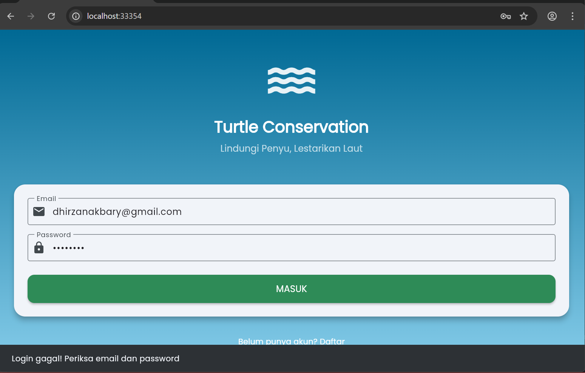
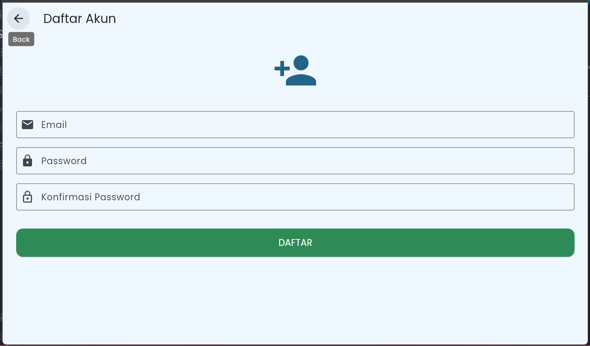
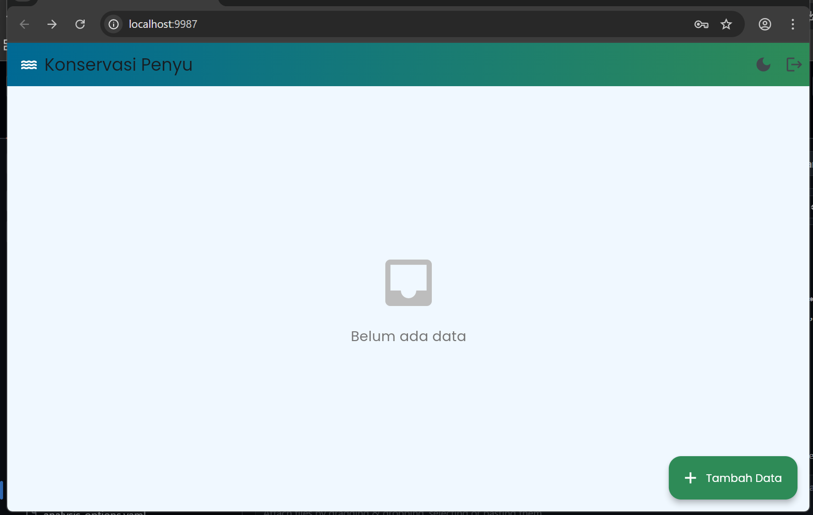
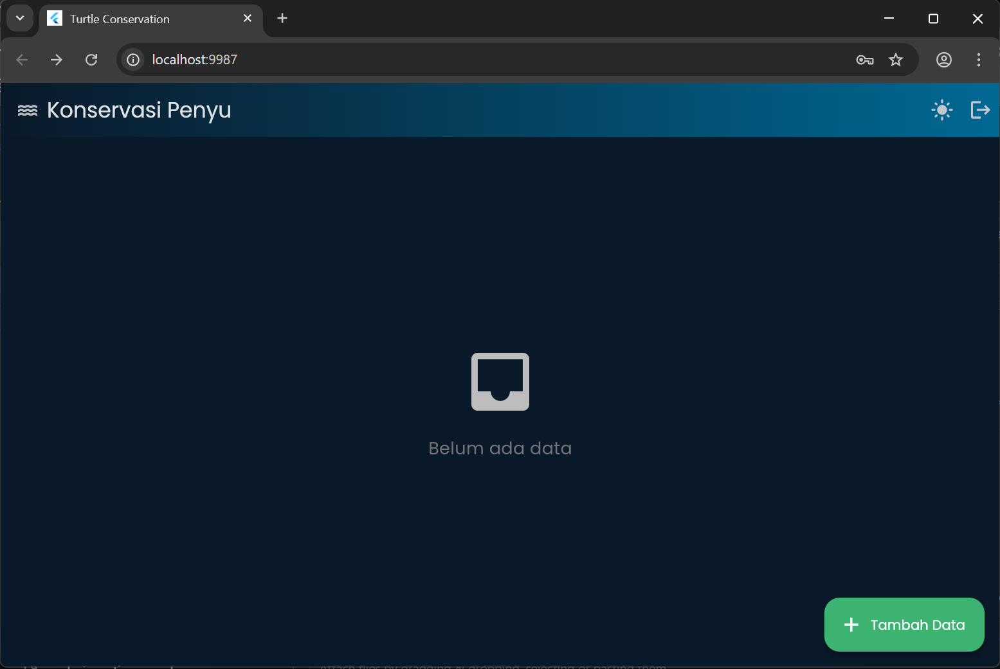
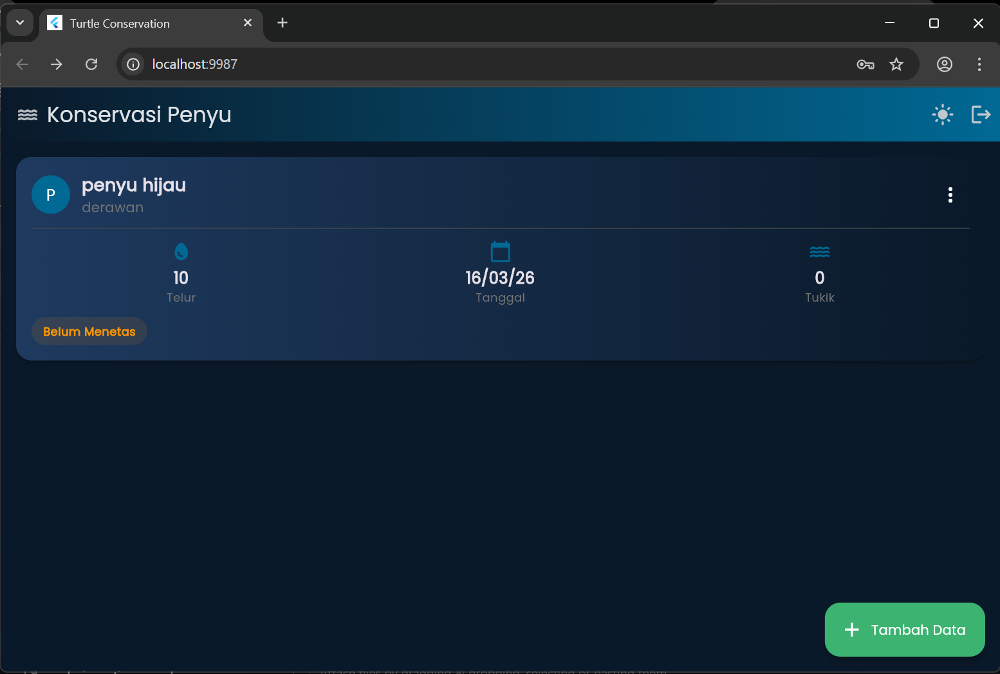
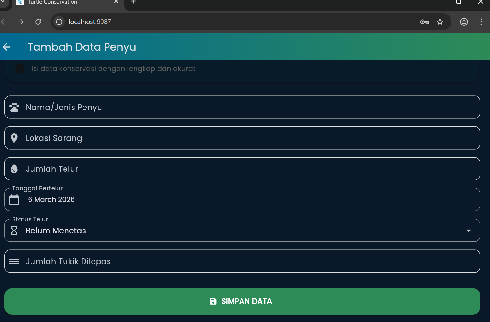
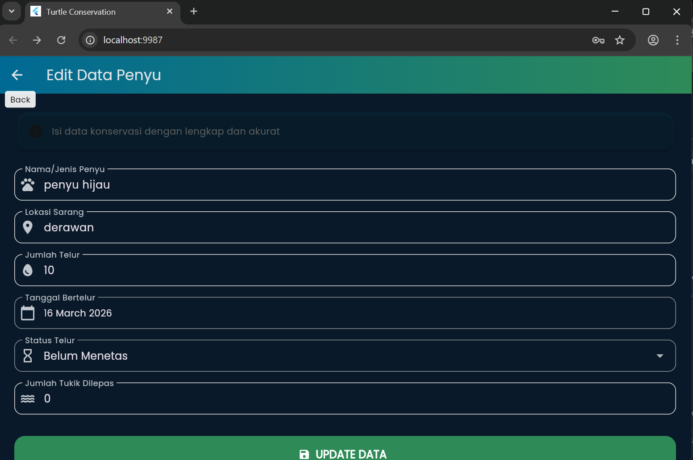
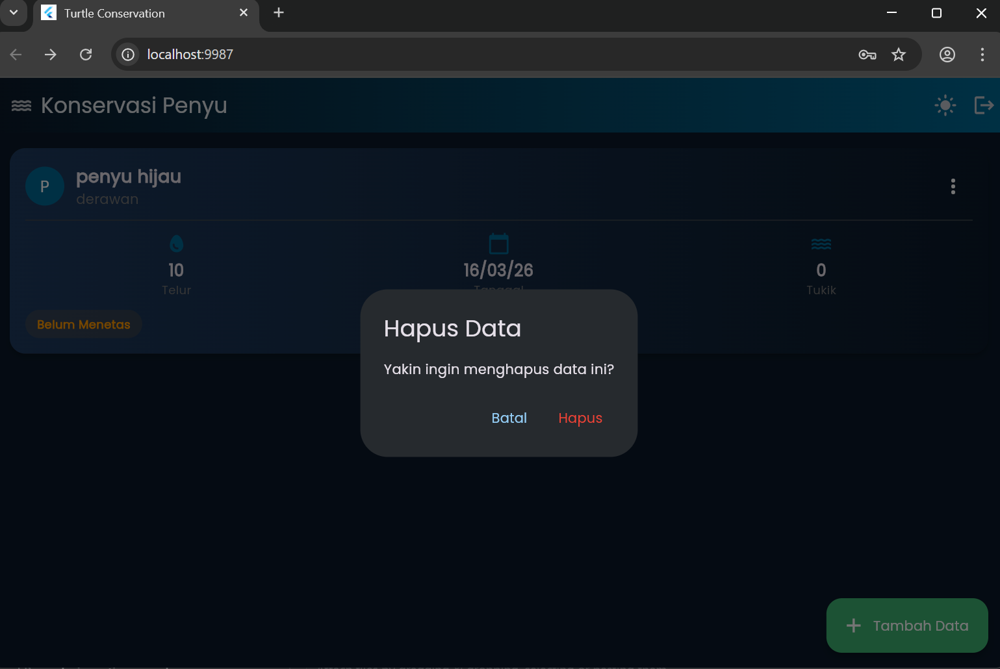

# 🐢 Turtle Conservation App

## 1. Deskripsi Aplikasi

Turtle Conservation App adalah aplikasi mobile untuk konservasi penyu menggunakan **Flutter** dan **Supabase**. Aplikasi ini digunakan oleh petugas konservasi pantai untuk mencatat dan mengelola data proses konservasi penyu, mulai dari pencatatan sarang, jumlah telur, data induk penyu, hingga pelepasan tukik ke laut.

Aplikasi memungkinkan petugas untuk:
- Mencatat penemuan sarang penyu di berbagai lokasi pantai
- Melacak perkembangan telur dari penjelasan hingga menetas
- Mencatat jumlah tukik (anak penyu) yang berhasil dilepas ke laut
- Mengelola data konservasi secara digital dan real-time

---

## 2. Fitur Aplikasi

### 2.1 Autentikasi (Login & Register)

Aplikasi menggunakan Supabase Auth untuk sistem login dan register. Setiap petugas memiliki akun sendiri untuk menjaga keamanan data.

---

### 2.2 Dark Mode & Light Mode

Pengguna dapat mengubah tema aplikasi antara Light Mode dan Dark Mode dengan tombol toggle di AppBar.

---

### 2.3 Halaman List Data Konservasi

Menampilkan semua data konservasi dalam bentuk Card yang berisi informasi nama penyu, lokasi, jumlah telur, tanggal, dan status.

---

### 2.4 Tambah Data Konservasi

Form untuk menambah data baru dengan field: nama penyu, lokasi sarang, jumlah telur, tanggal bertelur, status telur, dan jumlah tukik.

---

### 2.5 Edit Data Konservasi

Pengguna dapat mengedit data yang sudah ada melalui menu popup di setiap card.

---

### 2.6 Hapus Data Konservasi

Fitur hapus data dengan dialog konfirmasi untuk mencegah penghapusan accidental.

---

## 3. Widget yang Digunakan

| Widget | Fungsi dalam Aplikasi |
|--------|----------------------|
| `Scaffold` | Struktur dasar setiap halaman dengan AppBar dan body |
| `AppBar` | Bagian atas aplikasi dengan judul, tombol tema, dan logout |
| `Card` | Menampilkan setiap data konservasi dalam bentuk kartu yang menarik |
| `ListView.builder` | Menampilkan daftar data konservasi yang bisa di-scroll secara efisien |
| `TextFormField` | Input teks untuk nama penyu, lokasi, dan jumlah dengan validasi |
| `DropdownButtonFormField` | Pilihan status telur: "Belum Menetas" atau "Sudah Menetas" |
| `ElevatedButton` | Tombol utama untuk login, register, dan simpan data |
| `FloatingActionButton.extended` | Tombol mengambang untuk menambah data baru |
| `SnackBar` | Menampilkan pesan notifikasi sukses atau gagal |
| `DatePicker` | Pemilih tanggal bertelur dengan kalender |
| `RefreshIndicator` | Fitur tarik-refresh untuk memuat ulang data dari server |
| `CircleAvatar` | Menampilkan inisial huruf nama penyu dengan warna tema |
| `PopupMenuButton` | Menu titik tiga di setiap card untuk edit dan delete |
| `AlertDialog` | Dialog konfirmasi sebelum menghapus data |
| `InputDecorator` | Menampilkan tanggal yang dipilih dengan style yang rapi |
| `LinearGradient` | Background gradient biru laut untuk tema aplikasi |
